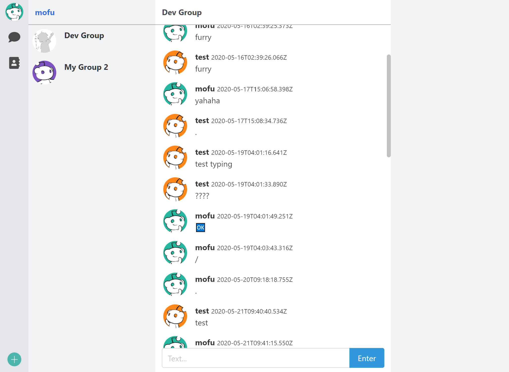

# mofu-web


production deployment at [`https://chat.mofu.ltd`](https://chat.mofu.ltd)

> A mofumofu server for online chat! 🦊 (web part)

## Current progresses



## Build Setup

``` bash
# install dependencies
npm install

# serve with hot reload at 127.0.0.1:8080
npm run dev

# build for production with minification
npm run build

# build for production and view the bundle analyzer report
npm run build --report

# run unit tests
npm run unit

# run all tests
npm test
```

For a detailed explanation on how things work, check out the [guide](http://vuejs-templates.github.io/webpack/) and [docs for vue-loader](http://vuejs.github.io/vue-loader).
